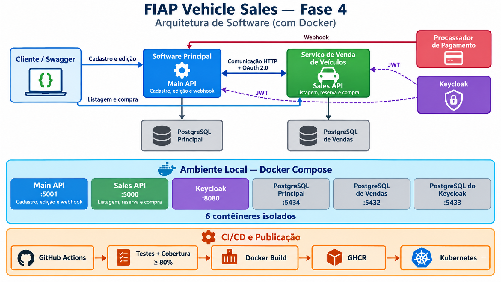

# FIAP Vehicle Sales — Software Principal

API principal da Fase 4 do Tech Challenge SOAT. Este repositório administra o catálogo de veículos e recebe o webhook público de pagamentos. Listagens, reserva e compra pertencem ao repositório separado do [serviço de venda de veículos](https://github.com/AdamMachado/fiap-vehicle-sales-Fase-4).

## Responsabilidades

- cadastrar e editar veículos no banco principal;
- sincronizar o catálogo com o serviço de vendas por HTTP;
- autenticar a comunicação interna por OAuth 2.0 client credentials;
- receber webhook protegido pelo header `X-Webhook-Secret`;
- encaminhar confirmação ou cancelamento ao serviço de vendas;
- armazenar notificações processadas para garantir idempotência;
- utilizar PostgreSQL diferente do banco transacional de vendas.

## Tecnologias e arquitetura

O projeto utiliza .NET 10, ASP.NET Core, Entity Framework Core, PostgreSQL, Docker, Swagger, xUnit, GitHub Actions e manifests Kubernetes. A solução segue uma separação inspirada em Clean Architecture:



- **Domain:** entidades e regras de negócio;
- **Application:** DTOs, interfaces e casos de uso;
- **Infrastructure:** PostgreSQL, repositórios e clientes HTTP;
- **API:** controllers, autenticação, Swagger e injeção de dependência.

```text
software-principal/
├── src/
│   ├── Fiap.VehicleSales.Main.Api
│   ├── Fiap.VehicleSales.Main.Application
│   ├── Fiap.VehicleSales.Main.Domain
│   └── Fiap.VehicleSales.Main.Infrastructure
├── tests/
│   ├── Fiap.VehicleSales.Main.UnitTests
│   └── Fiap.VehicleSales.Main.IntegrationTests
├── k8s/
├── scripts/
├── Fiap.VehicleSales.Main.slnx
├── docker-compose.yml
└── README.md
```

## Endpoints

| Método | Endpoint | Autorização |
| --- | --- | --- |
| POST | `/api/vehicles` | JWT com role `admin` |
| PUT | `/api/vehicles/{id}` | JWT com role `admin` |
| POST | `/api/payments/webhook` | header `X-Webhook-Secret` |
| GET | `/health/live` | público |

Cadastro de veículo:

```json
{
  "brand": "Toyota",
  "model": "Corolla XEi",
  "year": 2024,
  "color": "Prata",
  "price": 145900.00
}
```

Webhook:

```json
{
  "paymentCode": "codigo-retornado-na-compra",
  "status": "Completed"
}
```

Também aceita `Canceled`. A primeira notificação válida retorna `processed: true`; a repetição do mesmo resultado retorna `processed: false`. Um resultado contraditório para o mesmo código retorna conflito.

## Bancos e comunicação entre serviços

O banco principal armazena o catálogo administrativo e as notificações de pagamento processadas. O serviço de vendas possui outro PostgreSQL, responsável por veículos disponíveis, reservas e vendas. Nenhum serviço acessa diretamente o banco do outro.

```text
Processador de pagamento
          │ webhook HTTP
          ▼
Software principal ── HTTP + token de serviço ──► Serviço de vendas
       │                                           │
       ▼                                           ▼
PostgreSQL principal                       PostgreSQL de vendas
```

## Execução local

Pré-requisitos: Docker, Docker Compose, Git e, para testes fora dos contêineres, .NET 10 SDK.

Primeiro, clone e inicie o serviço de vendas, que também sobe o Keycloak:

```bash
git clone https://github.com/AdamMachado/fiap-vehicle-sales-Fase-4.git
cd fiap-vehicle-sales-Fase-4
docker compose up -d --build
```

Em outro diretório, clone e inicie este repositório:

```bash
git clone https://github.com/AdamMachado/fiap-vehicle-sales-software-principal-fase4.git
cd fiap-vehicle-sales-software-principal-fase4
docker compose up -d --build
```

| Recurso | Endereço local |
| --- | --- |
| Main API | `http://localhost:5001` |
| Swagger principal | `http://localhost:5001/swagger` |
| Serviço de vendas | `http://localhost:5000` |
| Swagger de vendas | `http://localhost:5000/swagger` |
| Keycloak | `http://localhost:8080` |
| PostgreSQL principal | porta `5434` |

As migrations são aplicadas automaticamente durante a inicialização da API.

Para encerrar preservando os dados:

```bash
docker compose down
```

`docker compose down --volumes` também apaga definitivamente os dados do banco principal e deve ser usado somente quando você realmente quiser reiniciar do zero.

## Autenticação administrativa e Swagger

O Keycloak do serviço de vendas importa este usuário local de demonstração:

```text
Usuário: admin@test.com
Senha: 123456
Role: admin
```

Obtenha o token no PowerShell:

```powershell
$adminTokenResponse = Invoke-RestMethod `
  -Method Post `
  -Uri "http://localhost:8080/realms/fiap-vehicle-sales/protocol/openid-connect/token" `
  -ContentType "application/x-www-form-urlencoded" `
  -Body @{
    client_id = "vehicle-sales-api"
    username = "admin@test.com"
    password = "123456"
    grant_type = "password"
  }

$adminTokenResponse.access_token
```

Acesse `http://localhost:5001/swagger`, clique em **Authorize** e informe somente o token. O Swagger acrescenta o prefixo `Bearer` automaticamente.

As credenciais e secrets documentados são exclusivos do ambiente local de demonstração e devem ser substituídos em qualquer ambiente publicado.

## Fluxo ponta a ponta pelo Swagger

1. Suba os dois Docker Compose.
2. Gere o token de `admin` e autorize o Swagger principal.
3. Execute `POST /api/vehicles` e guarde o GUID retornado.
4. No Swagger de vendas, execute `GET /api/vehicles/available` e confirme a sincronização.
5. Gere o token de `buyer@test.com` e autorize o Swagger de vendas.
6. Execute `POST /api/sales` com o GUID e um CPF válido.
7. Guarde o `paymentCode` retornado com status `Pending`.
8. Volte ao Swagger principal e abra `POST /api/payments/webhook`.
9. Em `X-Webhook-Secret`, informe `payment-webhook-local-secret`.
10. Envie o `paymentCode` com status `Completed`.
11. Repita o webhook e confirme `processed: false`.
12. No serviço de vendas, confirme o veículo em `GET /api/vehicles/sold`.

Para testar cancelamento, cadastre e compre outro veículo, envie `Canceled` no webhook e confirme que ele voltou para `GET /api/vehicles/available`.

## Testes e cobertura

```powershell
dotnet test Fiap.VehicleSales.Main.slnx `
  --configuration Release `
  --collect:"XPlat Code Coverage" `
  --settings coverage.runsettings `
  --results-directory TestResults

.\scripts\check-coverage.cmd -ResultsPath TestResults -Minimum 80
```

O wrapper `.cmd` aplica `ExecutionPolicy Bypass` somente ao processo de verificação, sem alterar permanentemente a configuração do Windows. O GitHub Actions chama o `.ps1` diretamente pelo `pwsh`.

A cobertura consolidada atual é 87,5% (91 de 104 linhas elegíveis). O pipeline
bloqueia resultados abaixo de 80%. A suíte possui 16 testes unitários e 4 testes
de integração para domínio, casos de uso, persistência, integração HTTP,
autorização e endpoints.

## CI/CD e publicação

O workflow executa restore, build, testes, validação da cobertura e do Docker Compose em Pull Requests para `main`. Depois do merge/push em `main`, publica a imagem no GHCR:

```text
ghcr.io/adammachado/fiap-vehicle-sales-main-api:<commit-sha>
ghcr.io/adammachado/fiap-vehicle-sales-main-api:latest
```

Os manifests em `k8s/` descrevem a implantação. Um cluster público exige que o ambiente de destino, secrets e credenciais de acesso sejam configurados.

## Kubernetes

Os manifests incluem Deployment e Service da API, StatefulSet e Service do banco próprio, ConfigMap, Secret de exemplo e volume persistente.

```bash
kubectl kustomize k8s
kubectl apply -k k8s
```

Antes do deploy, substitua os valores `CHANGE_ME`, configure o endereço do Keycloak e fixe a tag da imagem publicada.

## Roteiro para o vídeo

1. Mostrar os dois repositórios e seus bancos segregados.
2. Subir os dois ambientes com Docker Compose.
3. Mostrar Keycloak, Main API e serviço de vendas.
4. Executar cadastro e sincronização do veículo.
5. Executar listagem e compra autenticada.
6. Confirmar pagamento e demonstrar idempotência.
7. Demonstrar cancelamento com um segundo veículo.
8. Exibir testes, cobertura mínima de 80% e workflows aprovados.
9. Mostrar as imagens publicadas no GHCR e os manifests Kubernetes.

## Autor

Projeto desenvolvido para o Tech Challenge — Pós Tech FIAP — Fase 4 — SOAT.
